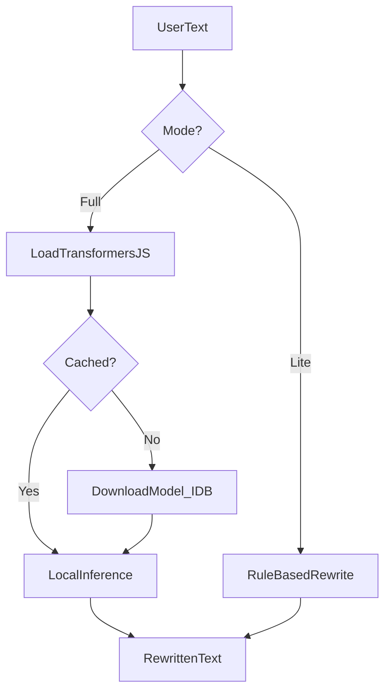

# Phase 3: Local AI

> Text rewrite and "humanizer" tool running entirely in the browser — no server, no API keys, no data leaving the device.

## Goal

Add an AI-powered text rewriting tool using Transformers.js for local inference, with an instant rule-based fallback for users who cannot or prefer not to download a model.

## Prerequisites

- [Phase 2: PDF Suite](./phase-2-pdf-suite.md) complete
- Tool plugin pattern and file-size warning infrastructure in place
- Understanding of browser memory constraints from PDF tools

## Deliverables

### Tool 7: Text Humanizer / Rewriter

- [ ] Split-pane layout: input textarea (left) + output textarea (right)
- [ ] "Rewrite" action button with loading state
- [ ] Model download progress bar (first use only)
- [ ] "Lite mode" toggle for instant heuristic rewrite (no model)
- [ ] Copy output, clear, swap input/output actions
- [ ] Tone selector: casual, formal, concise (heuristic mode only)

### Model infrastructure

- [ ] Dynamic import of `@xenova/transformers`
- [ ] Model cached in IndexedDB after first download
- [ ] WebGPU acceleration when available; CPU fallback
- [ ] Model size displayed before first download (~50–100MB quantized)

### Heuristic fallback

- [ ] Rule-based rewriter: synonym replacement, sentence restructuring
- [ ] Removes common AI filler phrases ("It's important to note", "In conclusion")
- [ ] Works instantly with zero download
- [ ] Available even when model fails to load

## Technical approach

### Dual-mode architecture



### Transformers.js integration

```typescript
import { pipeline } from '@xenova/transformers';

const rewriter = await pipeline('text2text-generation', 'Xenova/LaMini-Flan-T5-783M');
const result = await rewriter(input, { max_new_tokens: 512 });
```

Model selection criteria:
- Small enough for browser download (< 100MB quantized)
- Text-to-text generation task
- CPU-compatible (WebGPU optional acceleration)

Exact model TBD during implementation — evaluate 2–3 candidates for quality vs. size.

### Heuristic fallback engine

Pure TypeScript, no dependencies:

1. **Filler removal** — regex patterns for common AI phrases
2. **Synonym swap** — curated map of formal → casual word pairs
3. **Sentence shuffle** — reorder clauses in compound sentences
4. **Contraction expansion/contraction** — adjust formality level

Lite mode runs synchronously and completes in < 100ms for typical inputs.

### Caching strategy

| Storage | Content | Lifetime |
|---------|---------|----------|
| IndexedDB | Downloaded model weights | Persistent until user clears site data |
| Memory | Loaded pipeline instance | Current session |
| localStorage | User preference (full vs lite mode) | Persistent |

### File structure

```
src/pages/tools/text-humanizer.astro
src/scripts/tools/text-humanizer.ts
src/lib/ai/model-loader.ts       # Transformers.js init + cache
src/lib/ai/heuristic-rewriter.ts  # Rule-based fallback
src/lib/ai/filler-patterns.ts     # AI phrase detection regexes
src/components/ModelProgress.astro
```

## UI / design notes

Reuse the Text Analyzer split-pane pattern from Phase 1:

| Region | Content |
|--------|---------|
| Left pane | Input textarea with label "source — paste or type" |
| Right pane | Output textarea (read-only) with label "output — rewritten" |
| Action bar | Rewrite button (accent), lite mode toggle, copy, clear, swap |
| Status bar | Mode indicator, model status, word count |

First-time model download shows a progress bar replacing the output pane with download percentage and estimated size.

## Acceptance criteria

- [ ] Full mode rewrites a paragraph of text without any network call after model is cached
- [ ] Model downloads once and persists in IndexedDB across sessions
- [ ] Lite mode produces rewritten text instantly with no download
- [ ] Lite mode toggle switches between modes without page reload
- [ ] Progress bar shows during initial model download
- [ ] Tool works on CPU-only browsers (no WebGPU required)
- [ ] Copy output to clipboard works
- [ ] Error state shown gracefully if model fails to load (auto-fallback to lite mode)

## Out of scope

- Custom model training or fine-tuning
- Multi-language support (English only for v1)
- Grammar checking or spell correction
- Plagiarism detection
- Server-side inference or API proxy
- Image or document AI processing

## Risks & mitigations

| Risk | Mitigation |
|------|------------|
| Model download too large for mobile | Show size upfront; default to lite mode on mobile |
| Inference too slow on low-end devices | Lite mode always available; show elapsed time |
| Model quality insufficient | Heuristic fallback is the safety net; iterate on model choice |
| IndexedDB quota exceeded | Detect quota errors; offer lite mode with clear message |
| WebGPU not available | CPU pipeline works; no hard dependency on GPU |

## Next step

Proceed to [Phase 4: WASM Media](./phase-4-wasm-media.md).
