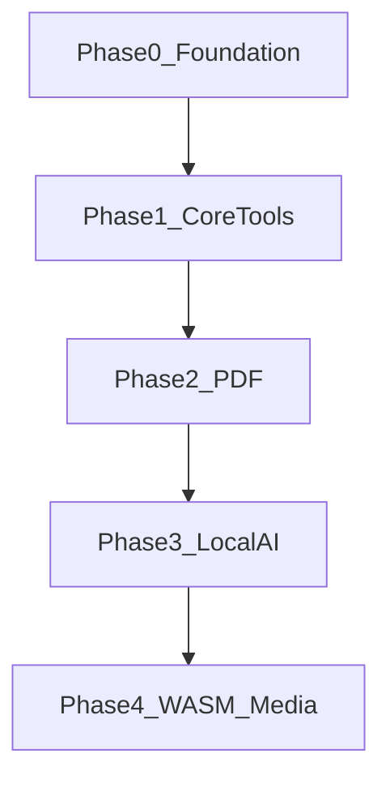
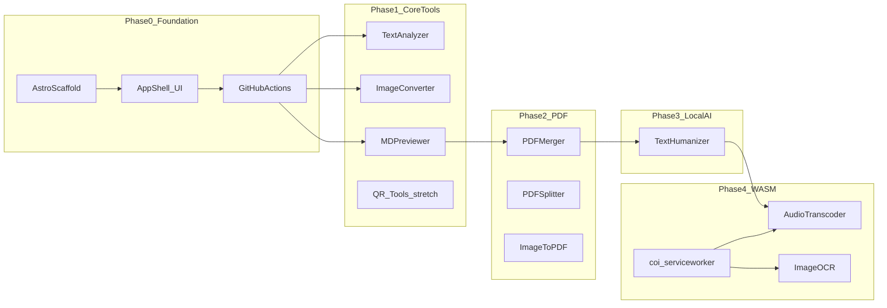

# Implementation Roadmap

utiliz is a privacy-first, ad-free utility hub where every operation runs in the browser. Files never leave the user's device. The site hosts for free on GitHub Pages and scales without backend costs.

## Quick path

1. **Phase 0** — Scaffold Astro, deploy the app shell.
2. **Phase 1** — Ship three core tools (text, image, markdown).
3. **Phases 2–4** — Add PDF, local AI, and WASM media tools incrementally.

## Phase overview

| Phase | Name | Goal | Key deliverables | Depends on |
|-------|------|------|------------------|------------|
| 0 | [Foundation](./phases/phase-0-foundation.md) | Runnable site with app shell on GitHub Pages | Astro scaffold, design tokens, AppShell layout, CI/CD | — |
| 1 | [Core Tools](./phases/phase-1-core-tools.md) | Launch with fast, zero-dependency utilities | Text Analyzer, Image Converter, MD Previewer (+ QR stretch) | Phase 0 |
| 2 | [PDF Suite](./phases/phase-2-pdf-suite.md) | Client-side document processing | PDF Merger, Splitter, Image-to-PDF via `pdf-lib` | Phase 1 |
| 3 | [Local AI](./phases/phase-3-local-ai.md) | Text rewrite without server calls | Humanizer via Transformers.js + heuristic fallback | Phase 2 |
| 4 | [WASM Media](./phases/phase-4-wasm-media.md) | Heavy media processing in-browser | Audio transcoder, Image OCR, `coi-serviceworker` | Phase 3 |

## Timeline

## Exit criteria summary

| Phase | Done when |
|-------|-----------|
| 0 | `npm run build` succeeds; site live on GitHub Pages; shell matches mockup |
| 1 | All 3 tools work offline; live stats, download, scroll-sync preview |
| 2 | Merge, split, and image-to-PDF work entirely in-browser |
| 3 | Rewrite works offline after first model cache; lite fallback always available |
| 4 | WAV→MP3 conversion and OCR work with COOP/COEP via service worker |

## Phase dependency map

## QR tools note

[Executive summary](./executive.md) lists QR generation and scanning in Phase 1. The [design brief](./design.md) focuses on three launch tools. **QR Generator/Scanner is a Phase 1 stretch goal** — native browser APIs only, no external libraries. Ship after the three core tools are stable.

## Documentation index

| Doc | Purpose |
|-----|---------|
| [Executive summary](./executive.md) | Business context, strategy, original vision |
| [Design brief](./design.md) | Stark & Structural UI concept and Phase 1 tool specs |
| [Technical architecture](./tech.md) | Stack, patterns, design tokens, project structure |
| [Stark & Structural mockup](../stark_structural_ui_design.html) | Interactive UI prototype |
| [Phase 0: Foundation](./phases/phase-0-foundation.md) | Astro scaffold, shell, CI/CD |
| [Phase 1: Core Tools](./phases/phase-1-core-tools.md) | Text, image, markdown (+ QR stretch) |
| [Phase 2: PDF Suite](./phases/phase-2-pdf-suite.md) | pdf-lib document tools |
| [Phase 3: Local AI](./phases/phase-3-local-ai.md) | Transformers.js humanizer |
| [Phase 4: WASM Media](./phases/phase-4-wasm-media.md) | ffmpeg.wasm, Tesseract.js |
