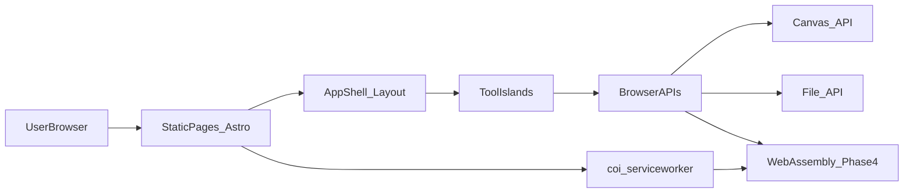

# Technical Architecture

utiliz is a privacy-first, client-side utility hub. Every tool runs entirely in the user's browser — no uploads, no backend, no database. The site ships as static HTML/CSS/JS on GitHub Pages with zero hosting cost.

## Quick path

1. Read this doc for stack, patterns, and constraints that apply to every phase.
2. Follow the [roadmap](./roadmap.md) for phase order and deliverables.
3. Match UI to the [design brief](./design.md) and the [Stark & Structural mockup](../stark_structural_ui_design.html).

## Architecture



| Principle | Decision |
|-----------|----------|
| Processing location | 100% client-side — files never leave the browser |
| Backend | None — no API routes, no database |
| Hosting | GitHub Pages (static export) |
| CI/CD | GitHub Actions — build on push, deploy to Pages |
| Cost model | $0 indefinitely (within GitHub free tier) |

## Stack

| Layer | Technology | Role |
|-------|------------|------|
| Framework | [Astro](https://astro.build) | Static site generation, component architecture, partial hydration |
| UI library | [WebcoreUI](https://webcoreui.dev) | Astro-native inputs, sliders, modals — no React overhead |
| Language | TypeScript | Tool logic, type safety |
| Styling | CSS custom properties | Design tokens from mockup; no CSS framework required |
| Icons | Tabler Icons | Consistent icon set used in mockup |
| Fonts | Inter (sans), JetBrains Mono (mono) | Loaded via `@fontsource` or Google Fonts |
| CI/CD | GitHub Actions | Build + deploy workflow |
| WASM isolation | `coi-serviceworker` | Emulates COOP/COEP headers for SharedArrayBuffer (Phase 4) |

## Design System

Tokens are defined in [`stark_structural_ui_design.html`](../stark_structural_ui_design.html). All components must use CSS variables — never hardcode colors.

### Dark theme (default)

| Token | Value | Usage |
|-------|-------|-------|
| `--bg` | `#000000` | Page background |
| `--bg2` | `#0A0A0A` | Secondary surfaces (sidebar, editor) |
| `--bg3` | `#111111` | Hover / active states |
| `--border` | `#1F1F1F` | Primary borders |
| `--border2` | `#2A2A2A` | Secondary borders, inputs |
| `--text` | `#FAFAFA` | Primary text |
| `--text2` | `#A1A1AA` | Secondary text |
| `--text3` | `#52525B` | Muted text, labels |
| `--accent` | `#22C55E` | Active states, primary actions |
| `--accent2` | `#F59E0B` | Secondary highlights |

### Light theme

Applied via `.light-mode` class on the app root. Background flips to `#FFFFFF`, borders to `#E4E4E7`, text to `#09090B`. Accent colors shift slightly (`--accent: #16A34A`).

### Typography

| Role | Font | Usage |
|------|------|-------|
| UI text | Inter, system-ui | Labels, body, sidebar |
| Data / code | JetBrains Mono, Fira Code | Stats, file names, tool titles, line numbers |

### Layout rules

- Zero border-radius (`--radius: 0px`) — sharp, structural panes
- No box shadows — borders define structure
- Grid-based layout: header (42px) + body (sidebar 200px + workspace flex)
- Tool panes fill 100% of remaining viewport height

## App Shell Contract

Every tool page shares a single layout shell:

```
┌─────────────────────────────────────────────┐
│ Header: logo · search (⌘K) · theme toggle   │
├──────────┬──────────────────────────────────┤
│ Sidebar  │ Tool workspace (full height)     │
│ (tools)  │                                  │
│          │                                  │
└──────────┴──────────────────────────────────┘
```

| Region | Behavior |
|--------|----------|
| **Header** | Logo (`util.tools`), global search input (Phase 0: placeholder; later: fuzzy tool search), light/dark toggle persisted in `localStorage` |
| **Sidebar** | Collapsible tool list grouped by category (text, media, dev, pdf, ai). Active tool highlighted with left accent border |
| **Workspace** | Renders the active tool component at full remaining height |
| **Status bar** | Optional per-tool footer (line counts, sync status) |

Reference implementation: [`stark_structural_ui_design.html`](../stark_structural_ui_design.html).

## Tool Plugin Pattern

Each tool is an independent Astro page with an optional client-side island for interactivity.

```
src/
├── layouts/
│   └── AppShell.astro          # Shared shell (header, sidebar, theme)
├── components/
│   ├── Header.astro
│   ├── Sidebar.astro
│   ├── ThemeToggle.astro
│   └── FileSizeWarning.astro   # Reusable 200MB banner
├── pages/
│   ├── index.astro             # Redirect or landing
│   └── tools/
│       ├── text-analyzer.astro
│       ├── image-converter.astro
│       └── md-previewer.astro
├── scripts/
│   └── tools/
│       ├── text-analyzer.ts    # Island logic
│       ├── image-converter.ts
│       └── md-previewer.ts
├── styles/
│   ├── tokens.css              # Design system variables
│   ├── shell.css               # App shell layout
│   └── tools/                  # Per-tool styles
├── lib/
│   ├── theme.ts                # Theme toggle + localStorage
│   ├── file-utils.ts           # Size checks, blob helpers
│   └── tool-registry.ts        # Sidebar nav metadata
└── data/
    └── tools.json              # Tool list for sidebar + search
```

### Adding a new tool

1. Create `src/pages/tools/<slug>.astro` using `AppShell` layout.
2. Add island script in `src/scripts/tools/<slug>.ts` if interactivity is needed.
3. Register the tool in `src/data/tools.json` (name, category, slug, icon, phase).
4. Add tool-specific styles in `src/styles/tools/<slug>.css`.

Astro ships zero JS by default — only tool pages that need interactivity pay the JS cost.

## Privacy & File Limits

| Rule | Detail |
|------|--------|
| No server uploads | All `FileReader`, `Canvas`, and WASM operations stay in-browser |
| Soft limit | Warn at 200MB via `FileSizeWarning` component |
| Hard guidance | Show estimated memory usage for PDF/WASM tools |
| Data persistence | Theme preference in `localStorage` only; no user data stored |

## Cross-Origin Isolation (Phase 4)

GitHub Pages cannot set `Cross-Origin-Opener-Policy` or `Cross-Origin-Embedder-Policy` headers. Tools requiring `SharedArrayBuffer` (ffmpeg.wasm) need `coi-serviceworker`:

- **Phase 0:** Register the service worker stub; no functional impact on basic tools.
- **Phase 4:** Activate full COOP/COEP emulation before loading WASM modules.

## External Dependencies by Phase

| Phase | Libraries | Load strategy |
|-------|-----------|---------------|
| 0–1 | None (browser APIs only) | N/A |
| 2 | `pdf-lib` | Dynamic import on PDF tool routes |
| 3 | `@xenova/transformers` | Dynamic import + IndexedDB model cache |
| 4 | `@ffmpeg/ffmpeg`, `tesseract.js`, `coi-serviceworker` | Dynamic import + web workers |

Never bundle heavy libraries globally — lazy-load per tool route.

## Build & Deploy

```text
push to main
  → GitHub Actions: npm ci && npm run build
  → Astro outputs to dist/
  → Deploy dist/ to GitHub Pages
```

Astro `site` config must match the GitHub Pages URL (e.g. `https://<user>.github.io/utiliz/`).

## Related docs

- [Roadmap](./roadmap.md) — phase overview and timeline
- [Design brief](./design.md) — UI specs for Phase 1 tools
- [Executive summary](./executive.md) — business context and strategy
- [Phase specs](./phases/) — detailed deliverables per phase
